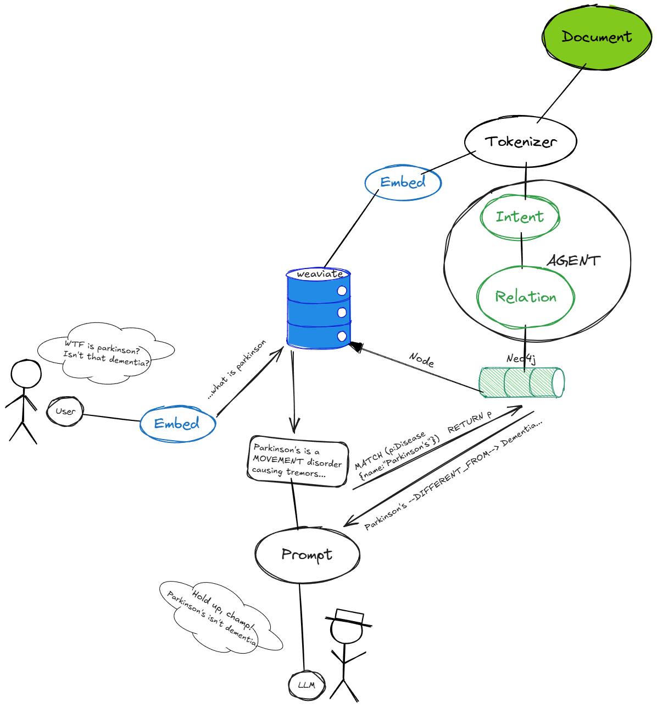
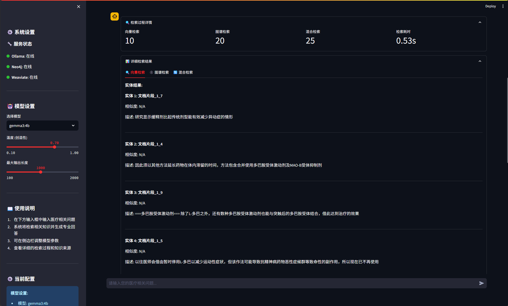
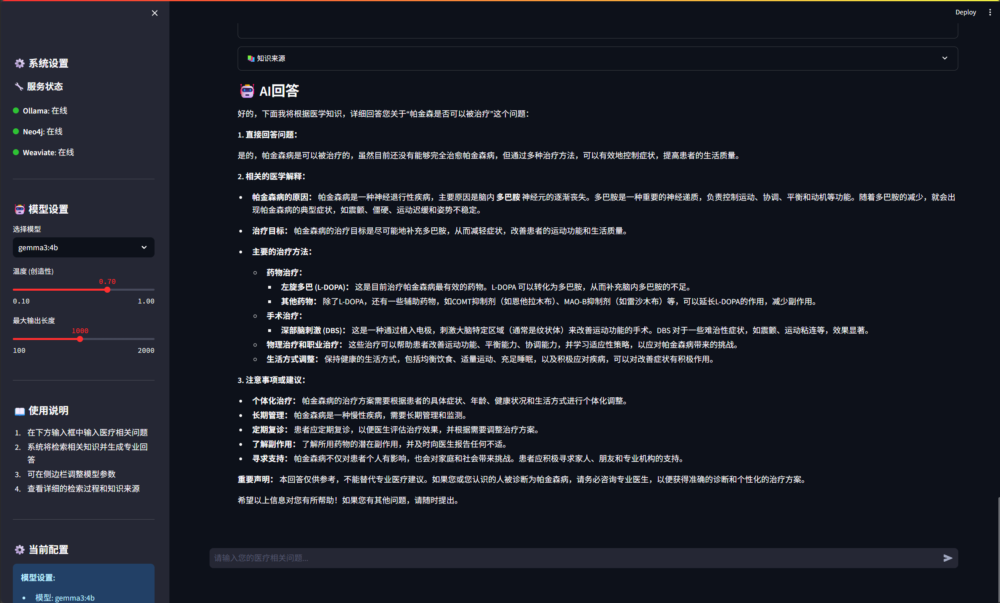
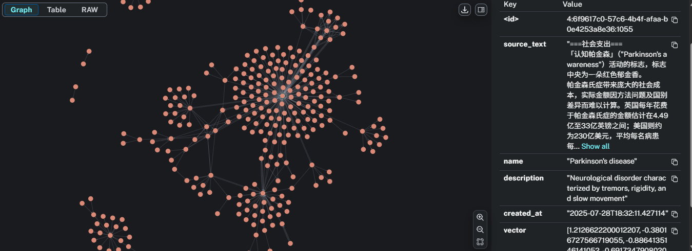

# HAG: 混合增强生成框架

<div align="center">

[](https://github.com/yankmo/HAG)
[](https://github.com/yankmo/HAG)
[](https://github.com/yankmo/HAG/issues)
[](https://github.com/yankmo/HAG/blob/main/LICENSE)
[](https://www.python.org/downloads/)
[](https://langchain.com/)
[](https://neo4j.com/)
[](https://weaviate.io/)

[English](README_EN.md) | [中文](README.md)

**作者**: [YankMo](https://github.com/yankmo)

</div>

---

## 🚀 HAG 是什么？

HAG（混合增强生成）是一个先进的知识增强生成框架，结合了向量数据库和知识图谱的强大功能，提供智能问答能力。基于 LangChain、Neo4j 和 Weaviate 构建，HAG 在领域特定知识检索和推理方面表现卓越。

## ✨ 核心功能

### 🔄 混合知识表示
- **双重存储架构**：无缝集成 Weaviate 向量数据库进行语义相似性搜索和 Neo4j 图数据库进行关系推理
- **多模态知识**：支持结构化（实体、关系）和非结构化（文档、文本块）知识表示
- **交叉索引映射**：维护图结构与原始文本片段之间的双向引用

### 🎯 高级检索系统
- **双重相似度指标**：结合余弦相似度和欧几里得距离，提高文档检索准确性
- **基于图的实体搜索**：利用 Neo4j 强大的图遍历能力进行实体和关系发现
- **加权混合检索**：智能平衡文档检索（60%）和图检索（40%）以获得最佳结果

### 🔗 LangChain 集成
- **可运行管道架构**：使用 LangChain 的 Runnable 接口构建模块化和可扩展的处理链
- **并行检索分支**：实现三个并发检索路径（文档、实体、关系）进行全面的知识收集
- **统一响应生成**：将多个知识源整合为连贯、上下文感知的响应

### 🌐 智能 Web 界面
- **Streamlit 驱动的 UI**：现代化、响应式的 Web 界面，便于交互
- **实时系统监控**：所有连接服务（Ollama、Neo4j、Weaviate）的实时状态指示器
- **交互式聊天体验**：具有消息历史和系统统计的对话界面

### 🔌 全面的 API 接口
- **RESTful API 设计**：清晰、文档完善的 API 端点，支持程序化访问
- **模块化服务架构**：独立的嵌入、检索和生成服务
- **错误处理和日志记录**：强大的错误管理和详细的调试日志

## 🏗️ 系统架构


*What is HAG*
## 📸 效果展示

### 1. Web 界面

*Linear设计风格前端*

### 2. 检索过程

*混合检索工作流程的可视化演示，结合向量数据库和图数据库*

### 3. 检索结果

*全面检索结果示例，展示文档、实体和关系信息*

### 4. 存储效果

*Weaviate 向量数据库和 Neo4j 知识图谱中的数据存储结构*

## 📦 安装

### 前置要求
- Python 3.8 或更高版本
- Docker 和 Docker Compose
- Git

### 快速开始

1. **克隆仓库**
```bash
git clone https://github.com/yankmo/HAG.git
cd HAG
```

2. **安装依赖**
```bash
pip install -r requirements.txt
```

3. **启动必需服务**
```bash
# 启动 Neo4j
docker run -d --name neo4j \
  -p 7474:7474 -p 7687:7687 \
  -e NEO4J_AUTH=neo4j/your_password \
  neo4j:latest

# 启动 Weaviate
docker run -d --name weaviate \
  -p 8080:8080 \
  -e QUERY_DEFAULTS_LIMIT=25 \
  -e AUTHENTICATION_ANONYMOUS_ACCESS_ENABLED=true \
  semitechnologies/weaviate:latest

# 启动 Ollama
docker run -d --name ollama \
  -p 11434:11434 \
  ollama/ollama:latest
```

4. **配置系统**
```bash
# 编辑配置文件
cp config/config.yaml.example config/config.yaml
# 更新数据库凭据和服务 URL
```

5. **运行应用程序**
```bash
# 启动 Web 界面
streamlit run app_simple.py

# 或直接使用 API
python api.py
```

## 🔧 配置

编辑 `config/config.yaml` 来自定义您的设置：

```yaml
# Neo4j 配置
neo4j:
  uri: "bolt://localhost:7687"
  username: "neo4j"
  password: "your_password"

# Ollama 配置
ollama:
  base_url: "http://localhost:11434"
  default_model: "gemma3:4b"
  embedding_model: "bge-m3:latest"

# Weaviate 配置
weaviate:
  url: "http://localhost:8080"
```

## 🧪 使用示例

### Web 界面
```bash
streamlit run app_simple.py
```
导航到 `http://localhost:8501` 并开始提问！

### API 使用
```python
from api import HAGIntegratedAPI

# 初始化系统
hag = HAGIntegratedAPI()

# 提问
response = hag.runnable_chain.invoke("帕金森病的症状是什么？")
print(response)
```

### 直接服务访问
```python
from src.services import HybridRetrievalService

# 直接使用混合检索
hybrid_service = HybridRetrievalService(...)
results = hybrid_service.search("医疗查询", limit=5)
```

## 🧪 测试

运行测试套件以验证您的安装：

```bash
# 测试基本功能
python -c "from api import HAGIntegratedAPI; api = HAGIntegratedAPI(); print('✅ HAG 初始化成功')"
```

## 🤝 贡献

我们欢迎贡献！请查看我们的[贡献指南](CONTRIBUTING.md)了解详情。

1. Fork 仓库
2. 创建您的功能分支 (`git checkout -b feature/AmazingFeature`)
3. 提交您的更改 (`git commit -m 'Add some AmazingFeature'`)
4. 推送到分支 (`git push origin feature/AmazingFeature`)
5. 打开 Pull Request

## 📄 许可证

本项目采用 MIT 许可证 - 查看 [LICENSE](LICENSE) 文件了解详情。

## 👨‍💻 作者

**YankMo**
- GitHub: [@yankmo](https://github.com/yankmo)
- CSDN 博客: [YankMo 的技术博客](https://blog.csdn.net/YankMo)

---

<div align="center">

**⭐ 如果这个项目对您有帮助，请给我们一个 Star！**

</div>
