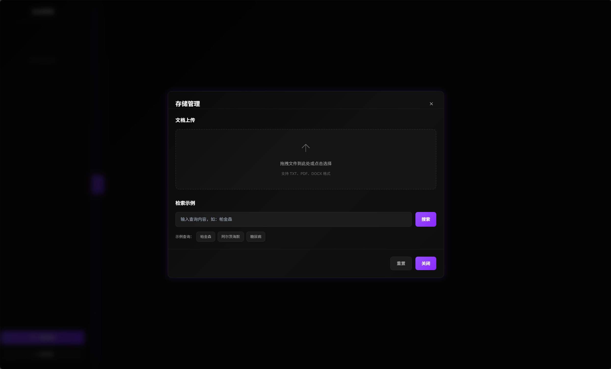

# HAG: Hybrid Augmented Generation Framework

<div align="center">

[](https://github.com/yankmo/HAG)
[](https://github.com/yankmo/HAG)
[](https://github.com/yankmo/HAG/issues)
[](https://github.com/yankmo/HAG/blob/main/LICENSE)
[](https://www.python.org/downloads/)
[](https://langchain.com/)
[](https://neo4j.com/)
[](https://weaviate.io/)

[English](README.md) | [中文](README_CN.md)

**Author**: [YankMo](https://github.com/yankmo)

</div>

---

## 🚀 What is HAG?

HAG (Hybrid Augmented Generation) is an advanced knowledge-enhanced generation framework that combines the powerful capabilities of vector databases and knowledge graphs to provide intelligent Q&A capabilities. Built on LangChain, Neo4j, and Weaviate, HAG excels in domain-specific knowledge retrieval and reasoning.

## ✨ Core Features

### 🎯 Intelligent Intent Recognition
- **Multi-dimensional Understanding**: Deep analysis of user query intent with precise knowledge need matching
- **Context Awareness**: Personalized responses based on conversation history and semantic understanding

### 🔄 Dual Database Integration Architecture
- **Vector Database**: Weaviate provides efficient semantic similarity search
- **Knowledge Graph**: Neo4j enables complex relationship reasoning and entity discovery
- **Hybrid Retrieval**: Intelligent fusion of two data sources ensuring retrieval accuracy and completeness

### 📁 Document Storage Management
- **File Upload**: Support for multiple document formats (PDF, TXT, DOCX, etc.) with drag-and-drop interface
- **Processing Pipeline**: Real-time document processing with progress tracking and status updates
- **Storage Statistics**: Comprehensive analytics for Neo4j entities/relationships and Weaviate vectors
- **Retrieval Testing**: Interactive search examples with dual-database query capabilities

### 🚀 Full-Stack Web Application
- **React Frontend**: Modern React-based user interface with responsive design
- **FastAPI Backend**: High-performance API server with comprehensive endpoint coverage
- **Real-time Updates**: Live progress monitoring and instant feedback for all operations
- **Session Management**: Persistent conversation history and user session handling

### 🎨 LINEAR Style Design
- **Modern Interface**: Clean and elegant user experience following LINEAR design principles
- **Dark Theme**: Professional dark mode interface with consistent styling
- **Intuitive Navigation**: Streamlined sidebar navigation with clear feature organization

## System Architecture


*What is HAG*

## 📸 Demo Gallery

### 1. Web Interface

*LINEAR style frontend interface*

### 2. Retrieval Effects

*Hybrid retrieval workflow demonstration, integrating vector database and knowledge graph*

### 3. Final Answer

*Intelligent Q&A result display with complete knowledge sources and reasoning process*

### 4. Session Management

*Session-based conversation management with persistent history*

### 5. Storage Management

*Document storage management with upload, processing, and retrieval features*

### 6. Retrieval Testing

*Interactive search example with dual-database query capabilities*

### 7. Neo4j Example

*Neo4j knowledge graph generation example, showing entity relationships and inference paths*

## 📦 Installation

### Prerequisites
- Python 3.8 or higher
- Node.js 16+ and npm
- Docker and Docker Compose
- Git

### Quick Start

1. **Clone Repository**
```bash
git clone https://github.com/yankmo/HAG.git
cd HAG
```

2. **Install Backend Dependencies**
```bash
pip install -r requirements.txt
```

3. **Install Frontend Dependencies**
```bash
cd frontend
npm install
cd ..
```

4. **Start Required Services**
```bash
# Start Neo4j
docker run -d --name neo4j \
  -p 7474:7474 -p 7687:7687 \
  -e NEO4J_AUTH=neo4j/your_password \
  neo4j:latest

# Start Weaviate
docker run -d --name weaviate \
  -p 8080:8080 \
  -e QUERY_DEFAULTS_LIMIT=25 \
  -e AUTHENTICATION_ANONYMOUS_ACCESS_ENABLED=true \
  semitechnologies/weaviate:latest

# Start Ollama
docker run -d --name ollama \
  -p 11434:11434 \
  ollama/ollama:latest
```

5. **Configure System**
```bash
# Edit configuration file
cp config/config.yaml.example config/config.yaml
# Update database credentials and service URLs
```

6. **Start the Application**
```bash
# Terminal 1: Start Backend API Server
python backend_api.py

# Terminal 2: Start Frontend Development Server
cd frontend
npm start
```

7. **Access the Application**
- Frontend: http://localhost:3000
- Backend API: http://localhost:8000
- API Documentation: http://localhost:8000/docs

## 🔧 Configuration

Edit `config/config.yaml` to customize your settings:

```yaml
# Neo4j Configuration
neo4j:
  uri: "bolt://localhost:7687"
  username: "neo4j"
  password: "your_password"

# Ollama Configuration
ollama:
  base_url: "http://localhost:11434"
  default_model: "gemma3:4b"
  embedding_model: "bge-m3:latest"

# Weaviate Configuration
weaviate:
  url: "http://localhost:8080"
```

## 🧪 Usage Examples

### Web Interface
Access the full-featured web application at `http://localhost:3000` after starting both backend and frontend servers.

**Main Features:**
- **Chat Interface**: Ask questions and get intelligent responses
- **Document Upload**: Upload and process documents for knowledge base expansion
- **Storage Management**: Monitor processing progress and view storage statistics
- **Retrieval Testing**: Test search capabilities across Neo4j and Weaviate databases

### API Usage
```python
import requests

# Query the HAG system
response = requests.post("http://localhost:8000/query", json={
    "query": "What are the symptoms of Parkinson's disease?",
    "session_id": "user_session_123"
})
result = response.json()
print(result["response"])

# Upload a document
with open("document.pdf", "rb") as f:
    files = {"file": f}
    response = requests.post("http://localhost:8000/storage/upload", files=files)
    upload_result = response.json()
    print(f"Task ID: {upload_result['task_id']}")

# Check processing progress
task_id = upload_result["task_id"]
response = requests.get(f"http://localhost:8000/storage/progress/{task_id}")
progress = response.json()
print(f"Progress: {progress['progress']}%")
```

### Direct Service Access
```python
from api import HAGIntegratedAPI

# Initialize system
hag = HAGIntegratedAPI()

# Ask questions
response = hag.runnable_chain.invoke("What are the symptoms of Parkinson's disease?")
print(response)

# Use hybrid retrieval directly
from src.services import HybridRetrievalService
hybrid_service = HybridRetrievalService(...)
results = hybrid_service.search("medical query", limit=5)
```

### Storage Management
```python
# Get storage statistics
response = requests.get("http://localhost:8000/storage/stats")
stats = response.json()
print(f"Total documents: {stats['total_documents']}")
print(f"Neo4j entities: {stats['neo4j_stats']['entities']}")
print(f"Weaviate vectors: {stats['weaviate_stats']['vectors']}")

# Test retrieval capabilities
response = requests.post("http://localhost:8000/storage/search/test", json={
    "query": "artificial intelligence",
    "search_type": "both"  # Options: "neo4j", "weaviate", "both"
})
search_results = response.json()
print("Neo4j results:", search_results["neo4j_results"])
print("Weaviate results:", search_results["weaviate_results"])
```

## 🧪 Testing

Run the test suite to verify your installation:

```bash
# Test basic functionality
python -c "from api import HAGIntegratedAPI; api = HAGIntegratedAPI(); print('✅ HAG initialized successfully')"
```

## 🤝 Contributing

We welcome contributions! Please check our [Contributing Guide](CONTRIBUTING.md) for details.

1. Fork the repository
2. Create your feature branch (`git checkout -b feature/AmazingFeature`)
3. Commit your changes (`git commit -m 'Add some AmazingFeature'`)
4. Push to the branch (`git push origin feature/AmazingFeature`)
5. Open a Pull Request

## 📄 License

This project is licensed under the MIT License - see the [LICENSE](LICENSE) file for details.

## 👨‍💻 Author

**YankMo**
- GitHub: [@yankmo](https://github.com/yankmo)
- CSDN Blog: [YankMo's Tech Blog](https://blog.csdn.net/YankMo)

---

<div align="center">

**⭐ If this project helps you, please give us a Star!**

</div>