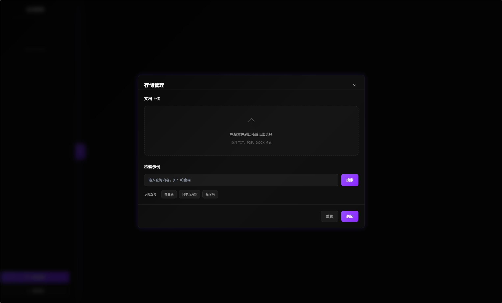
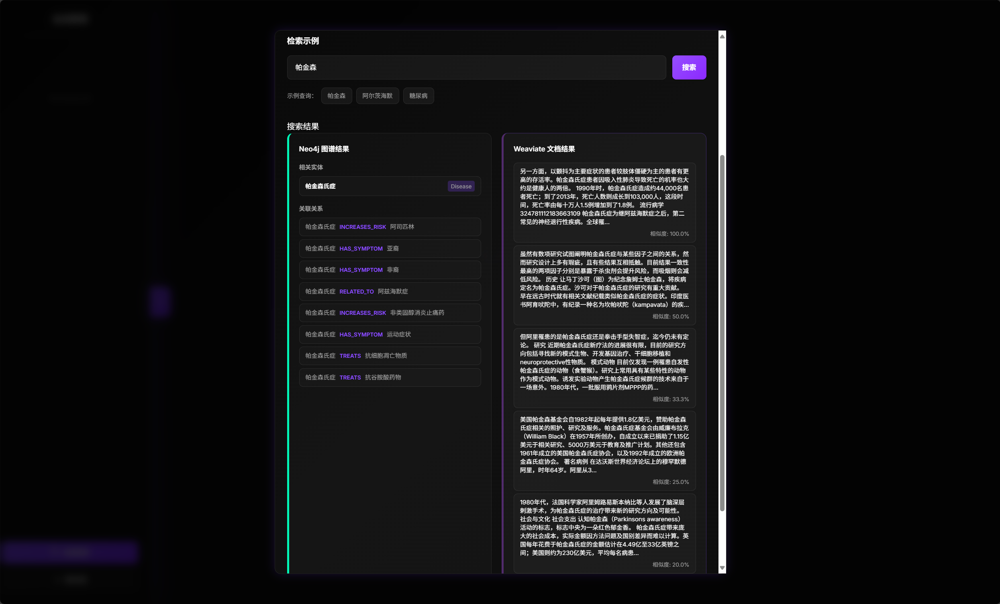

# HAG: 混合增强生成框架

<div align="center">


[](https://github.com/yankmo/HAG)
[](https://github.com/yankmo/HAG)
[](https://github.com/yankmo/HAG/issues)
[](https://github.com/yankmo/HAG/blob/main/LICENSE)
[](https://www.python.org/downloads/)
[](https://langchain.com/)
[](https://neo4j.com/)
[](https://weaviate.io/)

[English](README.md) | [中文](README_CN.md)

**作者**: [YankMo](https://github.com/yankmo)

</div>

***

## 🚀 HAG 是什么？

HAG（混合增强生成）是一个先进的知识增强生成框架，结合了向量数据库和知识图谱的强大功能，提供智能问答能力。基于 LangChain、Neo4j 和 Weaviate 构建，HAG 在领域特定知识检索和推理方面表现卓越。

## ✨ 核心功能

### 🎯 智能意图识别

* **多维度理解**：深度解析用户查询意图，精准匹配知识需求

* **上下文感知**：基于对话历史和语义理解，提供个性化响应

### 🔄 双数据库集成架构

* **向量数据库**：Weaviate 提供高效语义相似性搜索

* **知识图谱**：Neo4j 实现复杂关系推理和实体发现

* **混合检索**：智能融合两种数据源，确保检索准确性和完整性

### 📁 文档存储管理

* **文件上传**：支持多种文档格式（PDF、TXT、DOCX等），提供拖拽上传界面

* **处理流水线**：实时文档处理，支持进度跟踪和状态更新

* **存储统计**：全面的Neo4j实体/关系和Weaviate向量分析

* **检索测试**：交互式搜索示例，支持双数据库查询功能

### 🚀 全栈Web应用

* **React前端**：现代化React用户界面，支持响应式设计

* **FastAPI后端**：高性能API服务器，提供全面的接口覆盖

* **实时更新**：实时进度监控和所有操作的即时反馈

* **会话管理**：持久化对话历史和用户会话处理

### 🎨 LINEAR风格设计

* **现代化界面**：简洁优雅的用户体验，遵循LINEAR设计理念

* **深色主题**：专业的深色模式界面，样式一致

* **直观导航**：简化的侧边栏导航，功能组织清晰

## 系统架构


*What is HAG*

## 📸 效果展示

### 1. Web 界面


*LINEAR设计风格前端界面*

### 2. 检索效果


*混合检索工作流程展示，融合向量数据库和知识图谱*

### 3. 最终回答


*智能问答结果展示，包含完整的知识来源和推理过程*

### 4. 会话管理


*会话基于的对话管理，支持持久化历史记录*

### 5. 存储管理


*文档上传和处理流水线展示，包括进度监控和状态更新*

### 6. 检索测试


*交互式搜索示例，支持双数据库查询功能*

### 7. Neo4j生成样例


*Neo4j知识图谱生成示例，展示实体关系和推理路径*

## 📦 安装

### 前置要求

* Python 3.8 或更高版本

* Node.js 16+ 和 npm

* Docker 和 Docker Compose

* Git

### 快速开始

1. **克隆仓库**

```bash
git clone https://github.com/yankmo/HAG.git
cd HAG
```

1. **安装后端依赖**

```bash
pip install -r requirements.txt
```

1. **安装前端依赖**

```bash
cd frontend
npm install
cd ..
```

1. **启动必需服务**

```bash
# 启动 Neo4j
docker run -d --name neo4j \
  -p 7474:7474 -p 7687:7687 \
  -e NEO4J_AUTH=neo4j/your_password \
  neo4j:latest

# 启动 Weaviate
docker run -d --name weaviate \
  -p 8080:8080 \
  -e QUERY_DEFAULTS_LIMIT=25 \
  -e AUTHENTICATION_ANONYMOUS_ACCESS_ENABLED=true \
  semitechnologies/weaviate:latest

# 启动 Ollama
docker run -d --name ollama \
  -p 11434:11434 \
  ollama/ollama:latest
```

1. **配置系统**

```bash
# 编辑配置文件
cp config/config.yaml.example config/config.yaml
# 更新数据库凭据和服务 URL
```

1. **启动应用程序**

```bash
# 终端1：启动后端API服务器
python backend_api.py

# 终端2：启动前端开发服务器
cd frontend
npm start
```

1. **访问应用程序**

* 前端界面：<http://localhost:3000>

* 后端API：<http://localhost:8000>

* API文档：<http://localhost:8000/docs>

## 🔧 配置

编辑 `config/config.yaml` 来自定义您的设置：

```yaml
# Neo4j 配置
neo4j:
  uri: "bolt://localhost:7687"
  username: "neo4j"
  password: "your_password"

# Ollama 配置
ollama:
  base_url: "http://localhost:11434"
  default_model: "gemma3:4b"
  embedding_model: "bge-m3:latest"

# Weaviate 配置
weaviate:
  url: "http://localhost:8080"
```

## 🧪 使用示例

### Web 界面

启动前后端服务器后，访问 `http://localhost:3000` 使用完整功能的Web应用程序。

**主要功能：**

* **对话界面**：提问并获得智能回答

* **文档上传**：上传和处理文档以扩展知识库

* **存储管理**：监控处理进度和查看存储统计

* **检索测试**：测试Neo4j和Weaviate数据库的搜索功能

### API 使用

```python
import requests

# 查询HAG系统
response = requests.post("http://localhost:8000/query", json={
    "query": "帕金森病的症状是什么？",
    "session_id": "user_session_123"
})
result = response.json()
print(result["response"])

# 上传文档
with open("document.pdf", "rb") as f:
    files = {"file": f}
    response = requests.post("http://localhost:8000/storage/upload", files=files)
    upload_result = response.json()
    print(f"任务ID: {upload_result['task_id']}")

# 检查处理进度
task_id = upload_result["task_id"]
response = requests.get(f"http://localhost:8000/storage/progress/{task_id}")
progress = response.json()
print(f"进度: {progress['progress']}%")
```

### 直接服务访问

```python
from api import HAGIntegratedAPI

# 初始化系统
hag = HAGIntegratedAPI()

# 提问
response = hag.runnable_chain.invoke("帕金森病的症状是什么？")
print(response)

# 直接使用混合检索
from src.services import HybridRetrievalService
hybrid_service = HybridRetrievalService(...)
results = hybrid_service.search("医疗查询", limit=5)
```

### 存储管理

```python
# 获取存储统计
response = requests.get("http://localhost:8000/storage/stats")
stats = response.json()
print(f"总文档数: {stats['total_documents']}")
print(f"Neo4j实体数: {stats['neo4j_stats']['entities']}")
print(f"Weaviate向量数: {stats['weaviate_stats']['vectors']}")

# 测试检索功能
response = requests.post("http://localhost:8000/storage/search/test", json={
    "query": "人工智能",
    "search_type": "both"  # 选项: "neo4j", "weaviate", "both"
})
search_results = response.json()
print("Neo4j结果:", search_results["neo4j_results"])
print("Weaviate结果:", search_results["weaviate_results"])
```

## 🧪 测试

运行测试套件以验证您的安装：

```bash
# 测试基本功能
python -c "from api import HAGIntegratedAPI; api = HAGIntegratedAPI(); print('✅ HAG 初始化成功')"
```

## 🤝 贡献

我们欢迎贡献！请查看我们的[贡献指南](CONTRIBUTING.md)了解详情。

1. Fork 仓库
2. 创建您的功能分支 (`git checkout -b feature/AmazingFeature`)
3. 提交您的更改 (`git commit -m 'Add some AmazingFeature'`)
4. 推送到分支 (`git push origin feature/AmazingFeature`)
5. 打开 Pull Request

## 📄 许可证

本项目采用 MIT 许可证 - 查看 [LICENSE](LICENSE) 文件了解详情。

## 👨‍💻 作者

**YankMo**

* GitHub: [@yankmo](https://github.com/yankmo)

* CSDN 博客: [YankMo 的技术博客](https://blog.csdn.net/YankMo)

***

<div align="center">

**⭐ 如果这个项目对您有帮助，请给我们一个 Star！**

</div>
