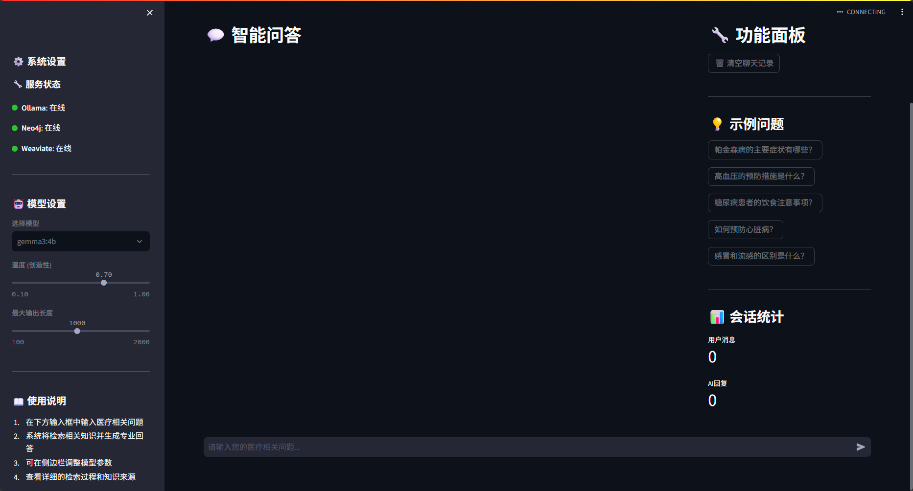

# HAG: Hybrid Augmented Generation

<div align="center">

[](https://github.com/yankmo/HAG)
[](https://github.com/yankmo/HAG)
[](https://github.com/yankmo/HAG/issues)
[](https://github.com/yankmo/HAG/blob/main/LICENSE)
[](https://www.python.org/downloads/)
[](https://langchain.com/)
[](https://neo4j.com/)
[](https://weaviate.io/)

**Author**: [YankMo](https://github.com/yankmo)

</div>

---

## 🚀 What is HAG?

HAG (Hybrid Augmented Generation) is an advanced knowledge-enhanced generation framework that combines the power of vector databases and knowledge graphs to provide intelligent question-answering capabilities. Built on top of LangChain, Neo4j, and Weaviate, HAG delivers superior performance in domain-specific knowledge retrieval and reasoning.

## 📸 Screenshots

### 1. Web Interface

*Modern Streamlit-powered web interface with real-time system monitoring and chat functionality*

### 2. Retrieval Process

*Visual demonstration of hybrid retrieval workflow combining vector and graph databases*

### 3. Retrieval Results

*Example of comprehensive retrieval results showing documents, entities, and relationships*

### 4. Storage Architecture

*Data storage structure in Weaviate vector database and Neo4j knowledge graph*

## ✨ Core Features

### 🔄 Hybrid Knowledge Representation
- **Dual Storage Architecture**: Seamlessly integrates Weaviate vector database for semantic similarity search and Neo4j graph database for relationship-based reasoning
- **Multi-Modal Knowledge**: Supports both structured (entities, relationships) and unstructured (documents, text chunks) knowledge representation
- **Cross-Index Mapping**: Maintains bidirectional references between graph structures and original text fragments

### 🎯 Advanced Retrieval System
- **Dual Similarity Metrics**: Combines cosine similarity and Euclidean distance for enhanced document retrieval accuracy
- **Graph-Based Entity Search**: Leverages Neo4j's powerful graph traversal capabilities for entity and relationship discovery
- **Weighted Hybrid Retrieval**: Intelligently balances document retrieval (60%) and graph retrieval (40%) for optimal results

### 🔗 LangChain Integration
- **Runnable Pipeline Architecture**: Built using LangChain's Runnable interface for modular and extensible processing chains
- **Parallel Retrieval Branches**: Implements three concurrent retrieval paths (documents, entities, relationships) for comprehensive knowledge gathering
- **Unified Response Generation**: Integrates multiple knowledge sources into coherent, contextually-aware responses

### 🌐 Intelligent Web Interface
- **Streamlit-Powered UI**: Modern, responsive web interface for easy interaction
- **Real-Time System Monitoring**: Live status indicators for all connected services (Ollama, Neo4j, Weaviate)
- **Interactive Chat Experience**: Conversational interface with message history and system statistics

### 🔌 Comprehensive API Interface
- **RESTful API Design**: Clean, well-documented API endpoints for programmatic access
- **Modular Service Architecture**: Independent services for embedding, retrieval, and generation
- **Error Handling & Logging**: Robust error management with detailed logging for debugging

## 🏗️ System Architecture

```
┌─────────────────┐    ┌─────────────────┐    ┌─────────────────┐
│   User Query    │    │  LangChain      │    │   Response      │
│                 │───▶│  Runnable       │───▶│   Generation    │
│                 │    │  Pipeline       │    │                 │
└─────────────────┘    └─────────────────┘    └─────────────────┘
                              │
                              ▼
                    ┌─────────────────┐
                    │ Parallel        │
                    │ Retrieval       │
                    │ Branches        │
                    └─────────────────┘
                              │
        ┌─────────────────────┼─────────────────────┐
        ▼                     ▼                     ▼
┌─────────────┐    ┌─────────────┐    ┌─────────────┐
│  Document   │    │   Entity    │    │Relationship │
│ Retrieval   │    │ Retrieval   │    │ Retrieval   │
│ (Weaviate)  │    │  (Neo4j)    │    │  (Neo4j)    │
└─────────────┘    └─────────────┘    └─────────────┘
```

## 📦 Installation

### Prerequisites
- Python 3.8 or higher
- Docker and Docker Compose
- Git

### Quick Start

1. **Clone the repository**
```bash
git clone https://github.com/yankmo/HAG.git
cd HAG
```

2. **Install dependencies**
```bash
pip install -r requirements.txt
```

3. **Start required services**
```bash
# Start Neo4j
docker run -d --name neo4j \
  -p 7474:7474 -p 7687:7687 \
  -e NEO4J_AUTH=neo4j/your_password \
  neo4j:latest

# Start Weaviate
docker run -d --name weaviate \
  -p 8080:8080 \
  -e QUERY_DEFAULTS_LIMIT=25 \
  -e AUTHENTICATION_ANONYMOUS_ACCESS_ENABLED=true \
  semitechnologies/weaviate:latest

# Start Ollama
docker run -d --name ollama \
  -p 11434:11434 \
  ollama/ollama:latest
```

4. **Configure the system**
```bash
# Edit configuration file
cp config/config.yaml.example config/config.yaml
# Update database credentials and service URLs
```

5. **Run the application**
```bash
# Start web interface
streamlit run app_simple.py

# Or use API directly
python api.py
```

## 🔧 Configuration

Edit `config/config.yaml` to customize your setup:

```yaml
# Neo4j Configuration
neo4j:
  uri: "bolt://localhost:7687"
  username: "neo4j"
  password: "your_password"

# Ollama Configuration
ollama:
  base_url: "http://localhost:11434"
  default_model: "gemma3:4b"
  embedding_model: "bge-m3:latest"

# Weaviate Configuration
weaviate:
  url: "http://localhost:8080"
```

## 🧪 Usage Examples

### Web Interface
```bash
streamlit run app_simple.py
```
Navigate to `http://localhost:8501` and start asking questions!

### API Usage
```python
from api import HAGIntegratedAPI

# Initialize the system
hag = HAGIntegratedAPI()

# Ask a question
response = hag.runnable_chain.invoke("What are the symptoms of Parkinson's disease?")
print(response)
```

### Direct Service Access
```python
from src.services import HybridRetrievalService

# Use hybrid retrieval directly
hybrid_service = HybridRetrievalService(...)
results = hybrid_service.search("medical query", limit=5)
```

## 🧪 Testing

Run the test suite to verify your installation:

```bash
# Test basic functionality
python -c "from api import HAGIntegratedAPI; api = HAGIntegratedAPI(); print('✅ HAG initialized successfully')"
```

## 🤝 Contributing

We welcome contributions! Please see our [Contributing Guidelines](CONTRIBUTING.md) for details.

1. Fork the repository
2. Create your feature branch (`git checkout -b feature/AmazingFeature`)
3. Commit your changes (`git commit -m 'Add some AmazingFeature'`)
4. Push to the branch (`git push origin feature/AmazingFeature`)
5. Open a Pull Request

## 📄 License

This project is licensed under the MIT License - see the [LICENSE](LICENSE) file for details.

## 👨‍💻 Author

**YankMo**
- GitHub: [@yankmo](https://github.com/yankmo)
- CSDN Blog: [YankMo's Tech Blog](https://blog.csdn.net/YankMo)

---

<div align="center">

**⭐ If this project helps you, please give us a Star!**

</div>